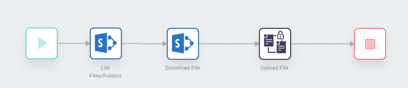
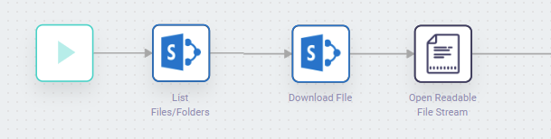
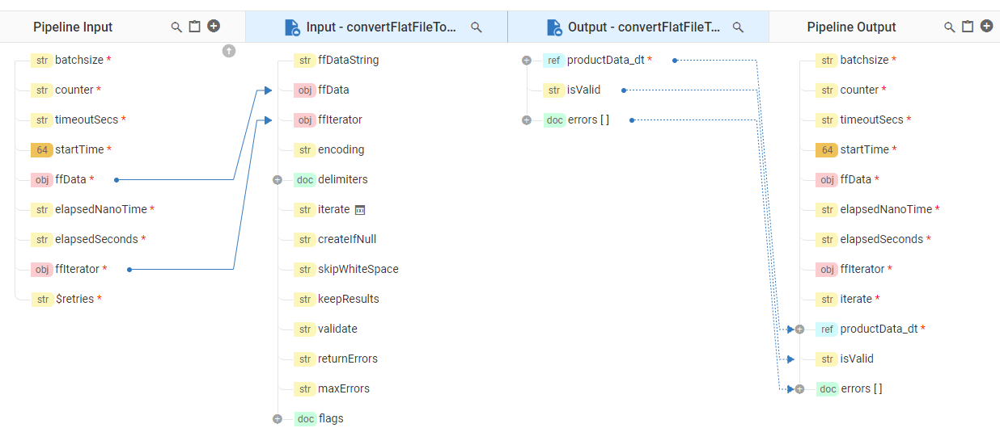

# 1.0 Introduction

This whitepaper provides information and guidelines for a webMethods.io integration developer, explaining the approaches, benefits and drawbacks on each approach, and provides some guidelines and recommendations as to which approach to pick and when, based on the functionality, and the skills of the person developing the integrations to integration applications.

*What is application integration?*

Gartner defines application integration as:

> Application integration is the process of enabling independently designed applications to work together. Commonly required capabilities include:
>
> * Keeping separate copies of data (in independently designed applications) consistent
> * Orchestrating the integrated flow of multiple activities performed by disparate applications
> * Providing access to data and functionality from independently designed applications through what appears to be a single user interface or application service
>   https://www.gartner.com/en/information-technology/glossary/application-integration

which is a succinct and accurate defition of what application integration is generally considered to be.

Historically Application integration was facilitated using a self-hosted integration platform that provides capabilities to enable integrations through standards based approaches, or via specific connectors, adapters or bespoke APIs.  These platforms were often implemented in a model known as an __Enterprise Service Bus (ESB)__.

> The Enterprise Service Bus is still a valid architectural choice, using platforms such as Sofware AG's [webMethods Integration  Server](https://www.softwareag.com/en_corporate/platform/integration-apis/webmethods-integration.html).  Particulalry beneficial when you are trying to connect lots of self-hosted products, and/or products with very bespoke integration requirements.  ESB implementations were traditionally implemented using a __Service Oriented Architecture (SOA)__ methodology, with a strong focus on reuse of services, implementing once, and governing the use of, as well as centralizing and canonicalizing data structures, taking data from a source system, transforming this to a pre-defined data structure that represents the business entity (known as a data canonical model), and then publishing this to a messaging platform, with subscribers reacting to these canonical messages, taking this, transforming to the structure of the destination system, and then using one of ESB functions to send this data to the target system.

More recently however, application integration has transformed into more modern architectures to suit the needs of organizations, which include:

__Microservice Based Integrations__

> Microservice Based Integrations are Facilitated by Microservice ready integration platforms, such as Software AG's [MicroServices Runtime (MSR)](https://www.softwareag.com/en_corporate/platform/integration-apis/microservices-platform.html), allowing the creation and deployment of microservices, to run at scale, as a part of an microservice archtecture, utilising micro API gateways, service or application meshs and more.  This is an approach suited to the most technical of integration and development teams, but is suitable in particual for cloud scale integration programs.

 __Cloud based integration__

> * Cloud based integration is useful when you're trying to interconnect many cloud (typically SaaS) by systems, and most often facilitated by an __Integration Platform As A Service (iPaaS)__, delivering the capabilities as a suite of cloud services. Some iPaaS platforms (such as Software AG's [webMethods.io Integration](https://www.softwareag.com/en_corporate/platform/integration-apis/api-integration-platform.html)) have been designed to support enterprise class integration initiatives.  This may sometimes be termed and Enterprise iPaaS, or __EiPaaS__.  These offer high availability, disaster recovery, security, SLAs, and capabilities to develop, execute and monitor many different integrations scenarios, deliver as a service, with managed upgrades.  In addition some iPaaS platforms also provide out-of-the-box support for multiple personas, covering the complete spectrum of users, from technical business users (sometimes termed business technologist, citizen integrators, or citizen developers), administrators, integration specialists, and developers, meaning the iPaaS offers capabilities to suite the needs of each of these differing personas, including hundreds of connectors to make it easy to integrate with systems for all skill sets.

__Hybrid Integration__

> This is an typical enterprise implementation style, mixing Cloud based EiPaaS platforms to easily integration SaaS systems, along with self-hosted systems, using a mix of Cloud and typically Microservice Based self-hosted integrations to achieve complex integrations spanning multi-cloud SaaS and self-hosted end points.

This white paper focuses on the EiPaaS and Hybrid styles of application integration using [webMethods.io Integration](https://www.softwareag.com/en_corporate/platform/integration-apis/api-integration-platform.html) providing some good practices, advice and guidance on what and how to implement using Softare AG's EiPaaS.

# 2.0 Guidelines

## 2.1 Integrations Automation Types

webMethods.io Integration currently provides two different approaches for developing integrations

* No-code Workflow Automations
* Low-code FlowSerivces Integrations

First, I'd like to explain the differences between these two approaches, their target persona, and some of the characterstics between these.

### 2.1.1 Workflow

[Workflow](https://docs.webmethods.io/integration/workflow_building_blocks/creating_first_workflow/) is a __No-code__ graphical orchestration editor, facilitating the creation of automations for a non-devloper.  A user constructs workflow automations by dragging and dropping actions and integration blocks (typically created by more technical users), then links these with simple decisional logic by dragging arrows between the actions, and same with the data fields.

Workflow is intended to be powerful, yet very easy to way to orchestrate pre-existing assets including the out-of-the-box connectors, and as such the lacks complex conditional logic and looping constructs a typical developer or integration specialist user would expect.

Due to it's power, some people mistake workflow for a programmatic construction tool, and can often attempt to create very complex logic which is a misuse of the tool.

#### Typical Users/Persona

Workflow is most typically used by a __Technical business user__.

Somebody usually from the business side of the organziation (not IT), and uses technology for business usage, with both internal and external needs.  They tend to have good IT experience, and can understand basic programmatic logic and constructs, and as such are more than capable of using no-code applciations.  Some of these people maybe more technical roles such as data scientist, software engineers and even developers, but are still part of a non-technical team, e.g. Marketing and often responsible for algorthims, analytics, pricing, and integration of data flows, and/or customer service interactions.

In additon to being used primarliy by the technical business user, workflows are also used by more developer centric roles because of the simplicity, allowing them to focus on the business need, and avoid the congitive load of creating a more complex solution.

### 2.1.2 FlowServices

#### Overview

[FlowSerivces](https://docs.webmethods.io/integration/developer_guide/flowservices/) are __Low-Code__ integrations, providing more programmatical constructs for power users, and those comfortable with programming, such as if/then/else, try catch, and complex looping such as repeat, do/until, and while do statements.  FlowService enforce an input and output contract, ensuring you think about the data that it will receive and return, and along with this facilitates more complex mapping requirements, with conditional maps, index based maps, constructs to rearrange the data structures wholly, and more.

Flows services are created top to bottom, using the keyboard or mouse and represented like a typical program, howevever the powerful mapper is used in place of variable definitions and data logic.

They are also the exact same FlowSerivces that existing in our self-hosted products, so a user with existing knowledge of webMethods can quickly and easily pick up and create FlowService logic in minutes.

#### Typical Users/Persona

FlowServices are typically used by __Integration Specialists / Developers__.

An integration specialist provides integration expertise, and often work in an Integration Center or Excellence (or competency center), responsible for integration of 'Tier 1' systems of records that are mission critical, and often on-premise, though more frequently includes the large SaaS vendors now.  Since they work with tier 1 systems, they need to implement complex logic that is fault tolerant, and implement high throughput, high performance real time integrations. Developers have a similar skill set but come from a more standard programmatic background and as such look for recognizable programmatic constructs.

### 2.1.3 Workflow/FlowServices Capability Comparison

| Item                            | Worflow                                                                                                                                                                                                                                                                                                                                                                                                                                                                                                                                                                            | FlowService                                                                                                                                                                                                                                                                                                                                                                                                                                                                                                                                                                                   |
| ------------------------------- | ---------------------------------------------------------------------------------------------------------------------------------------------------------------------------------------------------------------------------------------------------------------------------------------------------------------------------------------------------------------------------------------------------------------------------------------------------------------------------------------------------------------------------------------------------------------------------------- | --------------------------------------------------------------------------------------------------------------------------------------------------------------------------------------------------------------------------------------------------------------------------------------------------------------------------------------------------------------------------------------------------------------------------------------------------------------------------------------------------------------------------------------------------------------------------------------------- |
| UX                              | Graphical canvas, drag and drop, left to right creation of an automation, linking connectors/actions with arrows, presented in a diagrammatic format.                                                                                                                                                                                                                                                                                                                                                                                                                              | Programmatic creation of an integration service through keyboard or vertically oriented drag and drop, in a top to bottom orientation, presented as programmatic logic.                                                                                                                                                                                                                                                                                                                                                                                                                       |
| Data Mapping                    | [Simple to use data mapper](https://docs.webmethods.io/integration/workflow_building_blocks/creating_first_workflow/), that allows all prior action data to be mapped to the current action as needed, with a visual display of mapping, and outcomes using recorded test data.  Provides a large set of data transformers that can be used to transform data during mapping                                                                                                                                                                                                          | [Complex data mapper](https://docs.webmethods.io/integration/developer_guide/flowservices/#co-pipeline_intro) with a large set of transformers, that facilitates any mapping need, including transformation of data types, enumeration and  structures, as well as index and conditional mapping                                                                                                                                                                                                                                                                                                 |
| Decisional Logic Constructs     | [Switch](https://docs.webmethods.io/integration/additional_features/switch/)&nbsp;                                                                                                                                                                                                                                                                                                                                                                                                                                                                                                    | [Switch](https://docs.webmethods.io/integration/developer_guide/flowservices/), [if/then/else](https://docs.webmethods.io/integration/developer_guide/flowservices/)                                                                                                                                                                                                                                                                                                                                                                                                                                |
| Looping Constructs              | [Simple Loop (Repeat X times)](https://docs.webmethods.io/integration/additional_features/loop/), [Simple Loop (Repeat over list)](https://docs.webmethods.io/integration/additional_features/loop/)                                                                                                                                                                                                                                                                                                                                                                                    | [Repeat X Times](https://docs.webmethods.io/integration/developer_guide/flowservices/#co-coreelements), [Repeat over list](https://docs.webmethods.io/integration/developer_guide/flowservices/#co-coreelements), [Repeat over list1 and list2](https://docs.webmethods.io/integration/developer_guide/flowservices/#co-coreelements), [While/do](https://docs.webmethods.io/integration/developer_guide/flowservices/#co-coreelements), [do/until](https://docs.webmethods.io/integration/developer_guide/flowservices/#co-coreelements)                                                                    |
| Triggers to start integrations  | [webhook/http](https://docs.webmethods.io/integration/workflow_building_blocks/trigger/), [Schedule](https://docs.webmethods.io/integration/workflow_building_blocks/trigger/), [API](https://docs.webmethods.io/integration/apis/rest_api_builder/), [System triggers](https://docs.webmethods.io/integration/workflow_building_blocks/trigger/)                                                                                                                                                                                                                                            | [http](https://docs.webmethods.io/integration/developer_guide/flowservices/#co-tasksflowservices), [Schedule](https://docs.webmethods.io/integration/developer_guide/flowservices/#co-tasksflowservices), [API](https://docs.webmethods.io/integration/apis/rest_api_builder/), [Listeners](https://docs.webmethods.io/integration/developer_guide/listeners/)                                                                                                                                                                                                                                            |
| Scripting Capabilities          | [Node.js action](https://docs.webmethods.io/integration/developer_guide/creating_custom_actions_with_nodejs/)                                                                                                                                                                                                                                                                                                                                                                                                                                                                         | [is already a scripting language](https://docs.webmethods.io/integration/developer_guide/flowservices/)                                                                                                                                                                                                                                                                                                                                                                                                                                                                                          |
| Connector Creation Capabilities | [REST Connector](https://docs.webmethods.io/integration/connectors/connector-bundle/custom-con/#co-rest_connectors), [SOAP Connector](https://docs.webmethods.io/integration/connectors/connector-bundle/custom-con/#co-overview_soap_connector), [webMethods.io Connector Builder](https://tech.forums.softwareag.com/t/webmethods-io-connector-builder/240109), [On-Premise Connectors](https://docs.webmethods.io/integration/connectors/connector-bundle/custom-con/#co-on_premises_connectors), [Node.JS CLI](https://docs.webmethods.io/integration/developer_guide/connector_builder/) | [REST Connector](https://docs.webmethods.io/integration/connectors/connector-bundle/custom-con/#co-rest_connectors), [SOAP Connector](https://docs.webmethods.io/integration/connectors/connector-bundle/custom-con/#co-overview_soap_connector), [webMethods.io Connector Builder](https://tech.forums.softwareag.com/t/webmethods-io-connector-builder/240109), [On-Premise Connectors](https://docs.webmethods.io/integration/connectors/connector-bundle/custom-con/#co-on_premises_connectors), [Flat File](https://docs.webmethods.io/integration/connectors/connector-bundle/custom-con/#co-flatfile) |
| Doctype Support                 | No                                                                                                                                                                                                                                                                                                                                                                                                                                                                                                                                                                                 | [Yes](https://docs.webmethods.io/integration/developer_guide/flowservices/#co-document_types)                                                                                                                                                                                                                                                                                                                                                                                                                                                                                                    |
| Connector Support               | All Connectors except for: B2B related connectors - Electronic Data Interchange - FlatFile - webMethods.io B2B SAP ERP Connector Connector support documented for each connector [Here](https://docs.webmethods.io/integration/connectors/connector/)                                                                                                                                                                                                                                                                                                   | B2B related connectors All Enterprise Connectors (Some typically non mission ciritcal connectors are not supported) Connector support documented for each connector [Here](https://docs.webmethods.io/integration/connectors/connector/)                                                                                                                                                                                                                                                                                                                                          |

### 2.1.4 Workflow/FlowServices Performance Characteristics

| Item                                | Worflow                                                                                                                                                                                                                                                                                                                                                                                                                                               | FlowServicve                                                                                                                                                                                                                                                                                                                                                                              |
| ----------------------------------- | ----------------------------------------------------------------------------------------------------------------------------------------------------------------------------------------------------------------------------------------------------------------------------------------------------------------------------------------------------------------------------------------------------------------------------------------------------- | ----------------------------------------------------------------------------------------------------------------------------------------------------------------------------------------------------------------------------------------------------------------------------------------------------------------------------------------------------------------------------------------- |
| Integration Execution & Scalability | When executed, workflows are queued, and then allocated to an execution environment when one is available.  Paid customers have dedicated queues and their own execution pool, where as free customers share the queue/execution pool.  If the execution pool becomes exhausted, whilst we do scale up, you may see periods where a short wait may occur for an exection environment to become available or for the additional nodes to join the pool | FlowServices run in a multi-threaded server and immediately execute synchronously.  Flow services execute straight through and therefore provide significantly more performance than a workflow.  Multiple engines, also with scaling service the FlowService executions.                                                                                                                 |
| Maximum Asynchronous Execution Time | Asynchronous Workflows can run for a maximum of 30 minutes, with the maximum duration being configurable for each Workflow. Should there be a need for Workflowsto run for longer than 30 minutes will need to be executed across multiple engines, chained via invocations or messaging                                                                                                                                                              | A FlowService has no maximum execution time and can run for as long as is needed, however FlowServices are typically synchronous that can facilitate Asynchronous needs, via a HTTP call, or through the use of messaging.                                                                                                                                                                |
| Maximum Synchronous Execution Time  | Synchronous Workflows are those run through webHooks or via API calls with a return sync response.  These maintain an open connection between the invoker and the server until the workflow has fininshed or a timeout is reached.  This timeout can be from the workflow engine, or from the ingress layer and the maximum possible execution time is 3 minutes.                                                                                    | FlowServices are syncrhonous integrations and as they are running in a multithreaded and scaled engine, these can run indefintely.  To avoid thread starvation, loops which could run indefinitely have a timeout set on them which cannot be altered.  This value is defaulted currently to 6 hours and cannot be changed.  These loops include repeat for count, while/do and do/until. |
| RAM / Available Memory              | Workflows for paid customers execute in a 1GB execution environment.  Free customers execute in a 256MB environment.  You can see the memory size in the debug pane when you manually run a workflow in the editor. As each action in a workflow is additative, and actions cannot be dropped, the memory can be quickly exhausted when consuming large (typically file based payloads)                                                               | The integration servers have ~14GB of RAM available to them, which along with streaming and FlatFile parsing capabilities resulting in ability to support considerably larger file sizes when an integration is implemented correctly.                                                                                                                                                    |

### 2.1.5 Implementation recommendations and Patterns

Bearing the above information in mind, it's important to understand when you should use workflows, when you should use FlowServices, and the interaction patterns between these integration types.

#### Recommendations

**When to use Workflows**

* Event based integrations  "when *something* happens in System A, then do *something* in System B"
* If your need is for longer running __asynchronous__ integrations (up to 30 minutes)
* If you aim is for simple asynchronous __low throughput__ orchestration of __2 or 3 connectors__ and FlowServices together with __minimal transformation__ needs
* When you want to use a connector currently not available in the FlowServices IDE
* When you want to trigger an automation from a system connector

**When NOT to use Workflows**

* If you have more than 15 to 20 actions in a workflow
* If you're using lots of HTTP calls
* You're only orchestrating flow services
* If you're trying to write complex programmatic logic using workflow orchestration
* If you're using lots of store actions to programmatically adjust data
* When you have complex mapping needs
* When you have more than one, or complex loops
* If you expect realtime synchronous responses
* If you have a high throughput, high performance requirement
* If you're dealing with large volumes of data
* If you're exposing this as a real-time synchronous API
* If you're implementing integrations for B2B

**When to use FlowServices**

* If your need is for __synchronous__ integrations
* If you need high throughput, realtime and high performing integrations
* If you have complex programmatic logic/decisional conditions
* When your system has no standard APIs
* You have complex mapping requirements
* Need for many loops, nested, and/or different types
* If you need to restructure the data, types, formats, etc
* If you are processing large files or responses from systems
* If you're working with B2B and need to parse/validate and consume/transform EDI and other B2B payloads
* If you need to parse and transform otehr large 'flat-files', e.g, CSV, Fixed File format.
* If you're combining SOAP APIs for real time data exposure
* If you're combining REST APIs for real time data exposure
* Need complex exception handling and retry logic

**When NOT to use FlowServices**

* When you don't have programmatic skills
* When you are creating something simple
* When you want to create Node.JS basedCLI Connectors/actions

 

**Do's and Don'ts**

* **FlowService**
  * **Don't** invoke another FlowService to try and reuse integrations via HTTP - this results in significant overhead as you'll be routing out and into the platform again.  Instead think about integrations as Microservices, with replication rather than reuse, resulting in simpler and self contained deployments versus more complex dependency managed deployments that typically occur with an SOA style implementation.
  * **Don't** over use the LogCustomMessage service - this adds input/output database overhead to your invocations and will result in slower performance - only use this for small amounts of data, and in exceptional scenarios
  * **Don't** use For loop with a counter, rather use loop over a list, while/do do/until.  For loop with a counter currently has a significant performance penalty with a 1 second delay between each iteration
  * **Don't** attempt to create/mimic stateful services through the use of storage services/etc.
  * **Do** specify your service contract using constraints so you can easily validate the inputs/outputs.
  * **Do** keep the pipeline clean as you go - this not only makes mapping simpler as there's much less to select, but also helps to keep the memory clean.
  * **Do** consider error cases in particular on top-level FlowServices.  What happens if you try/catch, how do you signify to the platform/audit that a FlowService has failed, or a workflow thats invoked the FlowService.
  * **Do** make sure your pipeline at the last step matches the output - specifically take note of arrays/document lists.  If you're returning a list with a single item, this should still be a list and not a single item, and could cause other issues with subsequent steps/calls.
  * **Do** make sure and while/do do/until loop has a condition to exit that will fire.  Without this the FlowService will run for 6 hours before it times out (which equals 7200 transactions).  You can use CurrentNanoTime to make a time restricted while/do do/until loop if required to catch any accidental runs over a certain time period
  * **Do** remember FlowServices can be recursive for complex requirements, but take care not to create a stack overflow error.
* **Workflows**
  * **Don't** create nested loops, or have more than 1 or 2 loops.  This will quickly result in memory issues
  * **Don't** write extremely complex Node.JS actions - better to put this into a CLI connector.
  * **Don't** loop through a list to find a specific value, rather use JSON Path action
  * **Don't** abuse the store actions.  These are for very simple storage, not large or complex items that need ot be queried
  * **Do** remember that transformers can work with lists, dates, etc.
  * **Do** use other SaaS services, e.g. Azure DB / Amazon RDS for you own data storage needs
  * **Do** remember that a workflow commits a messaging item off a queue as soon as the trigger is complete, meaning you must handle this condition if something fails, or stick to FlowServices for messaging.
  * **Do** take care with email actions, there's more than one choice and each offers different capability, including SMTP, Send an Email, Office 365.
  * **Do** try to use the accounts feature for secure storage of secrets where possible for username/passwords/keys/etc, rather than defaulting these in mapping statements. It's better to create a REST connector than use HTTP or Swagger/RAML actions for this reason.

#### Patterns

**Large File Handling**

It is impossible to state an exact size of a File that a workflow or FlowService can process as this depends on the constructs used within the integrations.  When handling large files, loading any large file into memory, parsing, converting, etc whatever technology is almost always likely to create an 'out of memory' issue.  You can witness this yourself simply trying to load a very large file into notepad in windows, which attempts to load the whole file into memory, unlike something like notepad++ which only retrieves segments of files you're viewing/working on.

Bearing this in mind, ANY inegration which loads a file into memory could cause issues.

So, how do you manage to work with large files?

**Workflow**

Workflow executes in a 1GB container, which means any large file loaded into memory will likely cause issues, particularly if you pass the file data to other actions, which will create additional copies in memory.  All workflow actions are additive to the amount of data held in memory in the execution environment.  The more actions you have in a workflow, the more memory becomes consumed as the workflow progresses

Workflow for the most part can work with large files so long as you do NOT need to transform the data.  If you're moving content of a file from one system to another, this works so long as you utilise connectors that do not load the entire file by working with the item from the file store:

e.g. download a file from sharepoint, upload to an SFTP site

or you use connectors that along with readable file streams, support streaming the data, rather than loading the whole file into memory at once:

This does mean however that you  cannot change/transform the file content.

Typically most file actions work in one of these ways, however if you attempt to use the 'Read File' action, or use any connector which takes the file and returns content into the workflow, this will cause issues with large files or looping constructs.

Such examples that may cause issues with large files are:

* SpreadSheet Reader
* Read File
* ...

If you need to transform a large data file, there are multiple ways to achieve this

1. **Chunk the files at source** - if these are CSV files, repeating JSON nodes or XML nodes, the files can be chunked into smaller parts to avoid loading a complete file into memory.  If these can be chunked at source, they can be more easily parsed/transformed
2. **FlowServices** (see below)
3. If this is big data integration, consider using our **data integration platform [StreamSets](https://streamsets.com/)**

**FlowServices**

FlowServices have ~14GB of RAM available which sounds a lot, however this can also be quickly consumed with large files.
Consider an XML file, or a JSON file.  If this XML file has 1GB of data in it, and you want to put this into an XML DOM structure in memory, the memory consuption on this would be huge, easily more than 10 times the File size, which can quickly exhaust the available memory.

Working with FlowServices is no different.  If you create DocTypes/Document structures, and try to populate this with a large data set, this can quickly consume the memory on the environments, therefore alternate approaches need to be considered to parse and transform large files, including CSVs and/or fixed format files.

Working with Large CSVs/Fixed Format Files - this is the most common and typical integration usecase, quite often related to B2B implementations using EDI/CSV, etc.  webMethods.io Integration has a connector that is only available to the FlowService engine called [FlatFile](https://docs.webmethods.io/integration/connectors/connector-bundle/custom-con/#co-flatfile).  This connector allows you to define a structure of a file, either separated, or fixed length, and then you can use this created connector to parse a data file.

By default, this will still attempt to load the FlatFile document into memory and convert this to a doctype - however for large documents, this will create memory issues, and therefore you should use the 'iterator'

The iterator rather than loading the file in memory will iterate through each record one by one allowing you to transform and process each record individually however you choose.

This allows you to read and process ANY file size through the FlatFile (FF) Connector, where you can fully configure delimeters, etc for any needs.

Processing each line can be done in a called FlowService (to make editing easier), or can even be done through a messaging publish with a FlowService subscriber (or even a workflow).

**Using FlowServices & Workflow Together**

Transporting large data between workflows and FlowServices may also cause problems with the Workflow Engine, therefore if you do need to transport large data between them, there are a few implementation patterns you can use to do this

1. **Use Messaging** - This option really depends on the file size.  Once you've downloaded and read the file, you can send the file data via a messaging call to a FlowService by publishing the content, then subscribe from a FlowService to process the whole message.  As a FlowService has more memory, it's easier to chunk/split and parse sections of the file.  In addition you can use a topic and have multiple processors of the data via messaging.
2. **Use an Intermediary Store (e.g. AWS S3) -** Have a workflow trigger move a large file to an intermediary file store, e.g. downlaod a file from sharepoint and move to an AWS S3 location.  Once moved, you can pass the S3 location to a flowservice via a call, or via messaging if you're doing multiple files, please use queues and serialized subscribers if order is important.

**Workflow - Transforming data**

You can use a combination of a JSON Customizer as well as transformers to make some signficant changes to the data structures in a workflow, however you might find this easier to create a FlowService.

**Workflow - Parallel Processing**

Workflows do not have to be sequential - they can have parallel execution threads allowing more than one action to run concurrently.  Be cautious using these and remain concious of error handling in these scenarios.

---

## 2.2 API-Led Integration

webMethods.io EiPaaS supports a wide range of integration approaches and patterns, one of which is API-Led Integration, or API-Led Connectivity.  Many organizations start with the integration part of the iPaaS, but over time, might add B2B or API Management to support their needs / digital transformation initiaitves, and an iPaaS lends itself well to this approach as the components are all part of one wider platform.

Many vendors/integrators will tell you that APIs enable access to the systems, but that these should be tiered to foster resuability, akin to an SOA (service oriented architecture) methodology, however this often just serves to create complexity and effort waste with higher development requirements, and ultimatley minimal reuse regardless of the effort.

API-Led Integration rather through an iPaaS is tacked on two fronts

* Connectors, often provided by the platform vendor that utilize APIs and shield the complexities of these from the integrator, to avoid cognitive load and accelerate implementation - these will be covered further down this document.
* The ability to create Integrations from an API specification, or create an API from an Integration - the remainder of this section dicusses and provides guidance around this approach.  This isn't meant to provide an exhaustive guide to create APIs, rather explains the basics and how this can be achieved in webMethods.io Integration.

### 2.2.1 Creating an API from an Integration

APIs provided by webMethods.io Integration can be one of two types

* REST - The more modern and now most commonly used type of API
* SOAP - Historically popular, but usage has declined to the point where these are almost non-existant other than in legacy software that hasn't been updated.

#### 2.2.1.1 Creating a REST API from an Integration

A REST API makes use of HTTP verbs to provide data from server resources, typically implemented as follows:

| Verb   | Usage (CRUD)   |
| ------ | -------------- |
| GET    | Read           |
| POST   | Create         |
| PUT    | Update/Replace |
| PATCH  | Update/Modify  |
| DELETE | Delete         |

and use HTTP return codes to signify the state of the response, e.g.

| Return Code | Usage/Description        |
| ----------- | ------------------------ |
| 200/201     | Success                  |
| 204         | No content provided      |
| 404         | Not found/does not exist |
| 405         | Method not allowed       |
| 500         | Internal Error           |

A REST API typically is described via an OpenAPI (Swagger) specification, which can be used by a consumer to understand how to invoke the API, what the resources are, parameters, expected output, and return codes.

As such, this means that the API contract (it's inputs and outputs) must be understood, and potentially even able to be validated for conformity before processing the request.

Workflows in webMethods.io do not have an service contract, therefore to implement an API using a workflow you must

* Use a webhook and define the URL parameters/body which becomes the input
* Use the sync return output and provide a response
* Test both the webhook and the sync return output so the platform can observe the expected inputs/outputs and determine the data from this.

 Once you observe these requirements, you can simply expose the webhook enabled workflow as an API, however this comes with some considerable drawbacks and is therefore __NOT RECOMMENDED__ as an approach for REST APIs.  These drawbacks are:

* There is no explicit typing on the REST API Service contract
* There is no way to validate the inputs
* There could be a wait for a workflow engine to exectute the REST API request

 Therefore if you want to expose APIs from webMethods.io Integration, the __recommended__ mechansim is to create a FlowService and expose this as a REST API.  This recommendation is based no the following:

* A FlowService has defined inputs and outputs that can be both typed and validated with constraints, which generates a well formed and more complete API Specification.
* A FlowService by it's nature is synchronous and executes immediately with no waiting period

 To do this

* Create a Flow Service, providing the input and output parameters, defining any constraints, and types on the service contract
* Implement and test the FlowService, and make sure that the only data that is returned during your test conforms with the Output Parameters, else the response would be invalid compared to the API specification.  To do this use a transform pipeline step in the FlowService, and drop any parameters that are not in the output specification.
* You may alway wish to use try/catch construct to throw appropriate errors should any issues occur during the FlowService implementation
* Avoid the "logCustomMessage" service as this will impact performance of the REST API
* Implement the FlowService in the most efficient way possible.
* Once tested, switch to the [APIs tab](https://docs.webmethods.io/integration/apis/rest_api_builder/#ta-creating_an_api) in the project and press the CreateAPI, then Create from scratch to use the service implementation already created.
* Provide the name version, description and select the content types.
* Add a resource path (e.g. /customer), and select the resource method recalling the HTTP verbs previously, then select the FlowService.

 You API has now been generated and the specification available to download, or via access to the URL.

 Please note:

* The same resource path can be used with different verbs
* An API can have multiple resources if required.
* The accept header can control the format of the API response, e.g. setting accept to Application/XML will cause the API to return the response as XML.  Similar for Application/JSON and text/html.

#### 2.2.1.2 Creating a SOAP API from an Integration

This follows a similar process to the REST API, however due to the tighter requirement for a SOAP service on the input/output specification ONLY FlowServices can be used to provide a SOAP API.

#### 2.2.1.3 Securing APIs.

The APIs (and descriptors) are only accessible by default via HTTP Basic Authentication and requires an iPaaS user credential to be provided that has execute permissions on the the project where the API exists.

It is __NOT RECOMMENDED__ to expose these APIs directly to external consumers as the credential can be used to also login to the iPaaS.  If you must do this, please ensure you create a specific user for this purpose and with access only to execute the integrations in the contained project.

webMethods.io Integration provides alternative mechansims to provide secure APIs through one of:

* [Oauth2](https://docs.webmethods.io/integration/data_access_and_security/oauth20/)
* [Mutual TLS (2-way-ssl)](https://docs.webmethods.io/integration/data_access_and_security/clientcertificate)

Both of these options are available in the settings menu of the iPaaS, however, the best approach is to utilize the [API Gateway and Developer portal](https://docs.webmethods.io/api/index.html#/') to protect, control, and share these APIs with third parties

### 2.2.2 Creation an Integration from an API Specification

You can start an Integration from a REST API Specification - this will take the specification and generate the appropriate FlowServices with service contracts that represent the resources in the REST API.

Once these are generated, you can then proceed to provide the implementation using the FlowService editor.

This option allows you to create an API that conforms to a specification - perhaps your development processes first mean you create an API Specification, alternatively you might want to replace an existing API with an integration, and therefore want to assure that the specification exactly matches to avoid issues with consumers.

---

## 2.3 Hybrid Integration

Hybrid integration can be used to connect an on-premise/self-hosted execution environment, allowing FlowSerivces to be executed on that particular environment.

FlowServices requiring Hybrid Integration can be developed using Software AG's designer tool, and then published ot the cloud to auto create a connector that allows this to be invoked.  This is a very powerful function for invoke existing integrations or running what can be very complex integrations close to a source system (e.g. a self-hosted database, or an SAP ERP).

Please be aware routing to a hybrid integration is subject to latency and bandwidth restrictions from the cloud to wherever the hybrid end point is located.

To minimize this, it's recommended to avoid making lots of repeated calls to a hybrid endpoint by creating a wrapper service in the self-hosted exection environment that collects a call from the cloud, makes multiple calls back to the source system, and then returns back to the cloud once ready.

Please note also - hybrid integration calls have a maximum size limit of 50MB.

---

## 2.4 Connector Development

### 2.4.1 REST Connector

If you need to call a REST based system but there's no connector available, there are a few choices to implement this

#### 2.4.1.1 HTTP Action in workflow

This is not recommended to be used other than for quick tests/proof points.  Any secrets/etc have to be provided in the mapping, which makes this less secure.  If you do use this, please use the project parameters marking items as passwords were needed.  In addition, this action is only useful in this particular workflow so inhibits any reuse of the connector.

#### 2.4.1.2 Swagger/RAML actions in workflow

Like HTTP actions, this is also not recommened as has the same issues as the HTTP action.

#### 2.4.1.3 REST Connector Creator

The [REST connector creator](https://docs.webmethods.io/integration/connectors/connector-bundle/custom-con/) provides the facility to manually create a reusable connector scoped to the project that makes use of the account functionality to store secrets, as well as managing multiple auth types, headers, and much more.  This makes this a great choice for less technical people to create a REST connector in the UX.  Currently this does not support creation via an API specification.

#### 2.4.1.4 Connector Builder - Node.JS CLI

The [Node.JS CLI](https://docs.webmethods.io/integration/developer_guide/connector_builder/) allows a JavaScript developer to quickly create a connection from scratch, from an OpenAPI specification, or even from a Postman collection, as well as implementing any auth scheme required.  These connectors can be installed into any tenant and deployed from one tenant to another.

Please note, you can override a connector version, however if you change the connector interface, you will need to re-link/map this into the workflow again.  As such you can deploy the connector at the same version it you've not change the interface or only added new functions, however you should increment the version is you do change the interface.

Also note, that Node.JS CLI connectors can only be used in the Workflow currenly.

#### **2.4.1.5 Connector Builder - Cloudstreams**

The [webMethods.io Connector Builder](https://tech.forums.softwareag.com/t/webmethods-io-connector-builder/240109) can be used to programmatically create REST connectors using Software AG's FlowServices and/or Java using multiple authentication options, with complex knowledge.  These can also be created from REST Specifications (e.g. openapi).

Cloudstreams based connectors can be used both in Flow and Workflow, however stream types are only supported within a FlowService.

### 2.4.2. SOAP Connector

Like REST connectors, SOAP connectors can be created both in the UX, and via  the webMethods.io Connector Builder through Cloudstreams

### 2.4.3. Database Connector

The database connector allows you to utilize databases for queries/stored procedure calls, and modifications to table data.  This is a power function available to both Workflow and FlowServices, however please remember that

1. By default, transactions are implicitly managed, however, self managed transasctionality is available in a FlowService.
2. Your database needs to be accessible from Software AG's cloud environment.  Please proceed with caution if you do this to ensure your database is not open to unauthorized users.
3. As you'll be routing to your database from the cloud, please try to utilize the database correctly.  Do not make multiple calls and service logic if a SQL query can encompass all this.

### 2.4.4. FlatFile Connector

1. This can be utlized either by creating a flat file defition, or directly from within a FlowService without a defintion being created.
2. Large files (>200MB) will cause issues and will need to use the iterator to be processed
